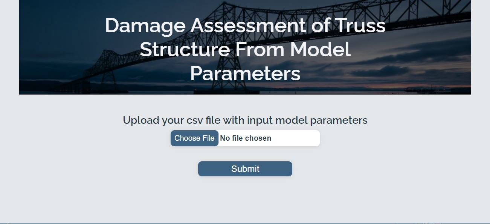
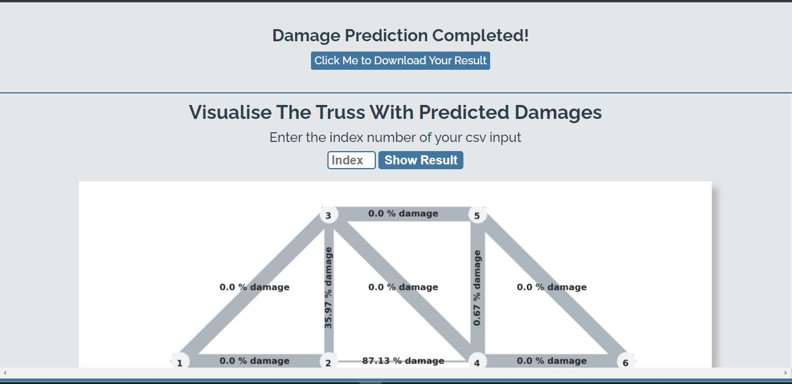
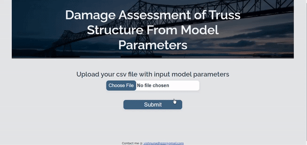

# Damage Assessment of Truss Structure from Model Parameters Using Deep Learning

The location and severity of damage of the components of a Truss structure is predicted from the model parameters (natural frequencies and mode shapes) measured from the damaged state of the Truss from feild test. As for the research purpose the data is generated from a choosen truss numerical model with induced damage conditions. This principle can be applied to real structures and revolutionarize the process of structural health monitoring.

## App Screenshots




## Demo



## Tech Stack

* **Client:** HTML, CSS, JavaScript

* **Server:** Python with libraries tensorflow, scikit-learn, pandas, numpy

* **API Framework:** Python Flask==2.0.2

## Run App Locally

To run the App locally python version 3.7 or higher should be installed in your computer

Clone the project

Go to the project directory you want to clone the project files

```bash
  cd your-project-directory
```

```bash
  git clone https://github.com/Vishnunadh-AI/Damage-Assessment-of-Truss-Structure-Using-Deep-Learning.git
```

Install dependencies

Choose your python environment to install dependencies and install the libaries using below commant in terminal

```bash
  pip install -r requirements.txt
```

Start the server

```bash
    main.py
```

Press Enter and visit the app from local host url shown in the terminal. Use csv data from the folder "testdatas" to test the app

## Reflection

- A research based project to have insights on how efficiently AI technology can be applied to structural health monitoring industry in civil engineering
- From research papers and my own expirimentations Deep Learning algorithm found to give the best prediction for this perticular multioutput regression problem
- Building an efficient data set from numerical model of truss(not included in the project file) and hyper parameter tuning of the deep learning model were the challenging part of this project.
- UI is created using HTML, CSS and javascript. Basic form validations (eg: non csv input,blank input, wrong index number for visualisation) are established.

## 🚀 About Me

- 📈I'm a Data scientist...
- 🖥Front end developer..
- 💻Tech enthusiast..
- 📖Avid learner..

## 🔗 Links

[](https://www.linkedin.com/in/vishnunadh/)
